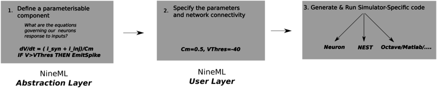

Motivation
==========

NineML_ is a language for describing the dynamics and connectivity of neuronal network
simulations; in particular for large-scale simulations of many point neurons.

Typically, networks of point-neurons are currently simulated by writing a either a custom
simulation program in a general purpose programming language (such as Python, MATLAB)
or by writing a model for a particular simulator (NEURON_/NEST_/Brian_). As models
of neuronal dynamics and connectivity become more and more complex, writing a
simulation from scratch in Python or Matlab can become more and more complex; taking
time to debug and producing hard to find bugs. Writing simulator-specific models
can reduce some of this duplication, but this means the model will only run on a single simulator
and is hence difficult to share.

Programmatic model description APIs such as PyNN_ ...

.. todo:: complete this intro...

NineML tries to mitigate some of these problems by providing an language for
defining smaller components of a simulation in a declarative, language-independent way, and
provides pathways for generating code for various simulators from this
description.

.. todo::  briefly explain the relationship to NeuroML

*Abstraction* and *User* Layers
--------------------------------

In NineML, the definition of a component is split into two parts;

Abstraction Layer
    Components on this layer can be thought of as parameterised models. For
    example, we could specify a general integrate-and-fire neuron, with a firing
    threshold, ``V_Threshold`` and a reset voltage ``V_Reset``. We are able to
    define the dynamics of the neuron in terms of these parameters.

User Layer
    In order to simulate a network, we need to take the ``parameterised`` models from
    the ``Abstraction Layer``, fill in the parameters, and specify the
    connectivity between the components. For example, we might specify for our
    neurons that ``V_Threshold`` was -45mV and ``V_Reset`` was -60mV.

The flow for a simulation using NineML would look like:

An obvious question is `Why do this?!`

For a single, relatively simple simulation, it may not be worth the effort!
But imagine we are modelling a (relatively simple) network of neurons, which
contains 5 different types of neurons. The neurons synapse onto each other,
and there are 3 different classes of synapses, with different models for
their dynamics. If we were to implement this naively, we could potentially
copy and paste the same code 15 times, *for each simulator*. By factoring out
basic functionality, we make our workflow much more manageable.

.. _NineML: http://nineml.net
.. _NEURON: http://www.neuron.yale.edu/neuron/
.. _NEST: http://www.nest-initiative.org
.. _Brian: http://www.briansimulator.org
.. _PyNN: http://neuralensemble.org/PyNN/
